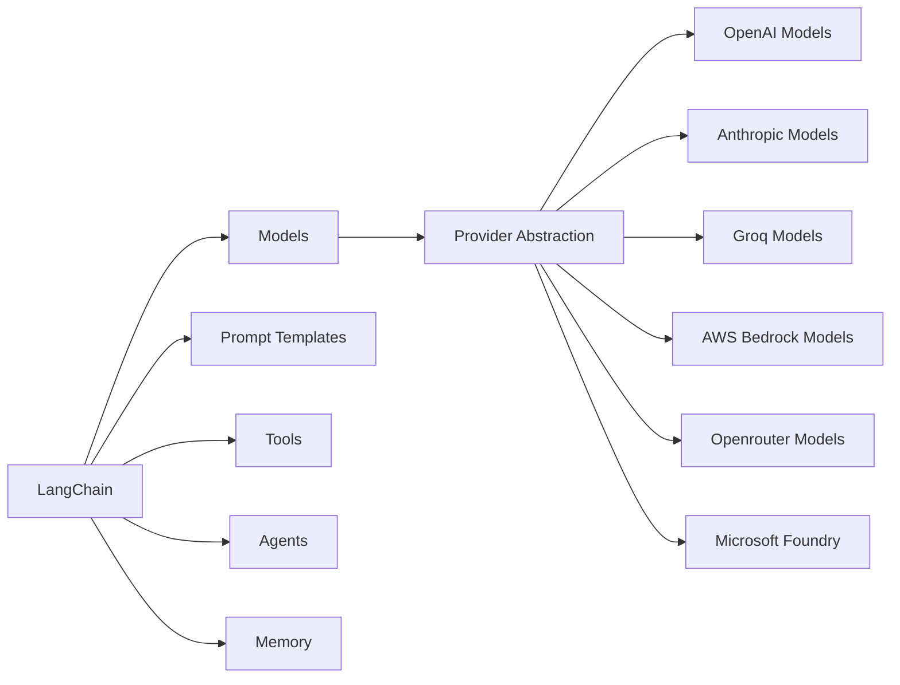
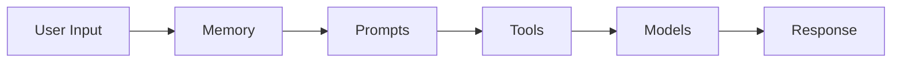

# Langchain
LangChain is a **framework for building AI-powered applications** using Large Language Models (LLMs).

Without LangChain, you'd need to:
- Write different code for each LLM provider (OpenAI, Anthropic, Azure, etc.)
- Build your own prompt management system
- Create custom tools and function calling logic
- Implement memory and conversation handling from scratch
- Build agent systems without any structure

### The LangChain Solution

With LangChain, you get:
- **Provider abstraction** - Switch between OpenAI, Azure, Anthropic with minimal code changes
- **Prompt templates** - Reusable, testable prompts
- **Tools** - Extend AI with custom functions and APIs
- **Memory** - Built-in conversation history
- **Agents** - Decision-making AI that can use tools

*These concepts work together to create powerful AI applications.*

---
## Core Concepts Overview

LangChain is built around below core concepts:

- **Models**: AI "brains" that process inputs and generate outputs.
- **Prompts**: How you communicate with AI models using reusable templates.
- **Tools**: Extend AI capabilities with external functions and APIs.
- **Memory**: Remember context across interactions.

---

### How These Concepts Work Together

