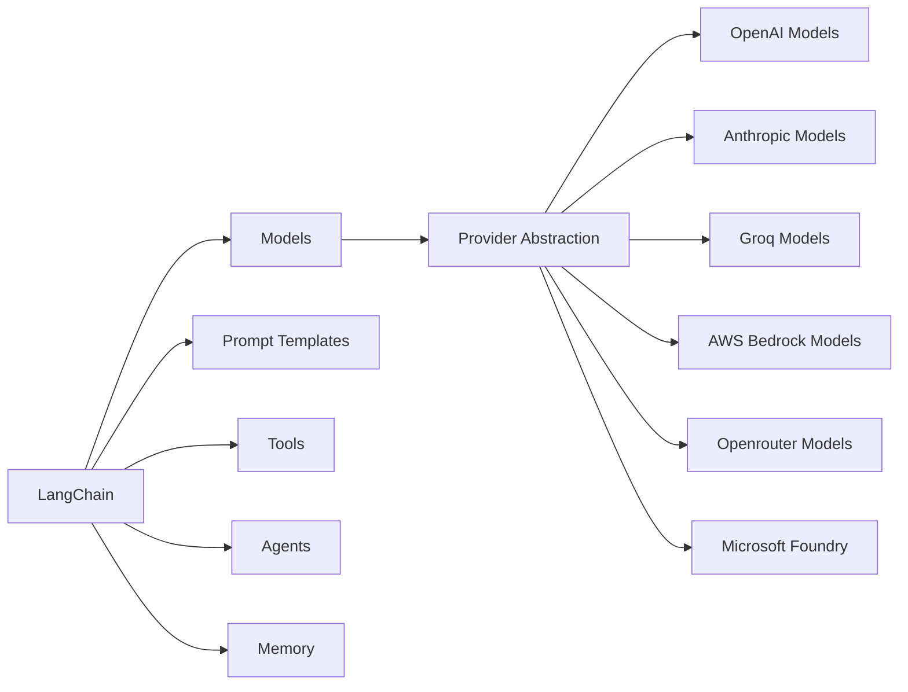
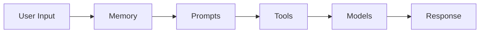
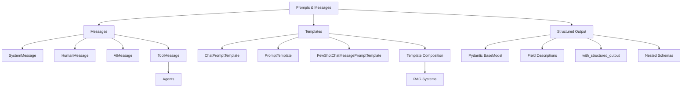

# Langchain
LangChain is a **framework for building AI-powered applications** using Large Language Models (LLMs).

Without LangChain, you'd need to:
- Write different code for each LLM provider (OpenAI, Anthropic, Azure, etc.)
- Build your own prompt management system
- Create custom tools and function calling logic
- Implement memory and conversation handling from scratch
- Build agent systems without any structure

### The LangChain Solution

With LangChain, you get:
- **Provider abstraction** - Switch between OpenAI, Azure, Anthropic with minimal code changes
- **Prompt templates** - Reusable, testable prompts
- **Tools** - Extend AI with custom functions and APIs
- **Memory** - Built-in conversation history
- **Agents** - Decision-making AI that can use tools

*These concepts work together to create powerful AI applications.*

---
## Core Concepts Overview

LangChain is built around below core concepts:

- **Models**: AI "brains" that process inputs and generate outputs.
- **Prompts**: How you communicate with AI models using reusable templates.
- **Tools**: Extend AI capabilities with external functions and APIs.
- **Memory**: Remember context across interactions.

---

### How These Concepts Work Together

---

## Messages & Prompts

---

## Langchain Summary [Still Learning]

| Component               | Purpose                                              | When to Use                 | Typical Enterprise Use Case              |
| ----------------------- | ---------------------------------------------------- | --------------------------- | ---------------------------------------- |
| **Models**              | Unified interface for LLMs                           | Every LLM application       | OpenAI, Claude, Gemini interchangeably   |
| **Messages**            | Manage conversation history                          | Chat applications           | AI Copilot, Chatbots                     |
| **Embeddings**          | Convert text into vectors                            | RAG, semantic search        | Knowledge base search                    |
| **Tools**               | Connect LLM with external systems                    | Need APIs or databases      | SQL, SAP, REST APIs                      |
| **Agents**              | Autonomous reasoning and tool selection              | Multi-step problem solving  | Enterprise AI assistants                 |
| **Middleware**          | Intercept requests/responses                         | Production deployments      | Logging, guardrails, authentication      |
| **Short-Term Memory**   | Preserve conversational context                      | Multi-turn chat             | Customer support bots                    |
| **Structured Output**   | Produce validated JSON or typed data                 | Automation and integrations | ETL, workflow orchestration              |
| **Context Engineering** | Build the right context for the model                | RAG and agent systems       | Enterprise knowledge retrieval           |
| **Runtime**             | Manage execution lifecycle                           | Production workloads        | Async processing, retries                |
| **Streaming**           | Return tokens incrementally                          | Interactive user interfaces | Chat applications, voice assistants      |
| **MCP**                 | Standard protocol for external tools                 | Multi-system AI integration | GitHub, Slack, databases, IDEs           |
| **Integrations**        | Connect to models, vector stores, loaders, and tools | Virtually every application | Pinecone, Chroma, S3, SharePoint, OpenAI |

