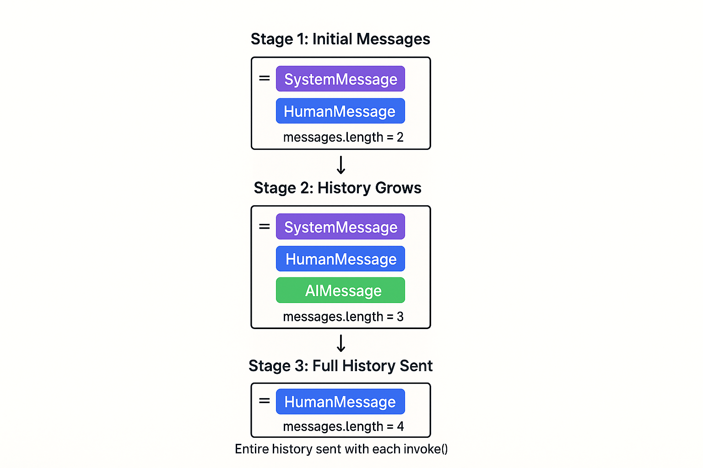
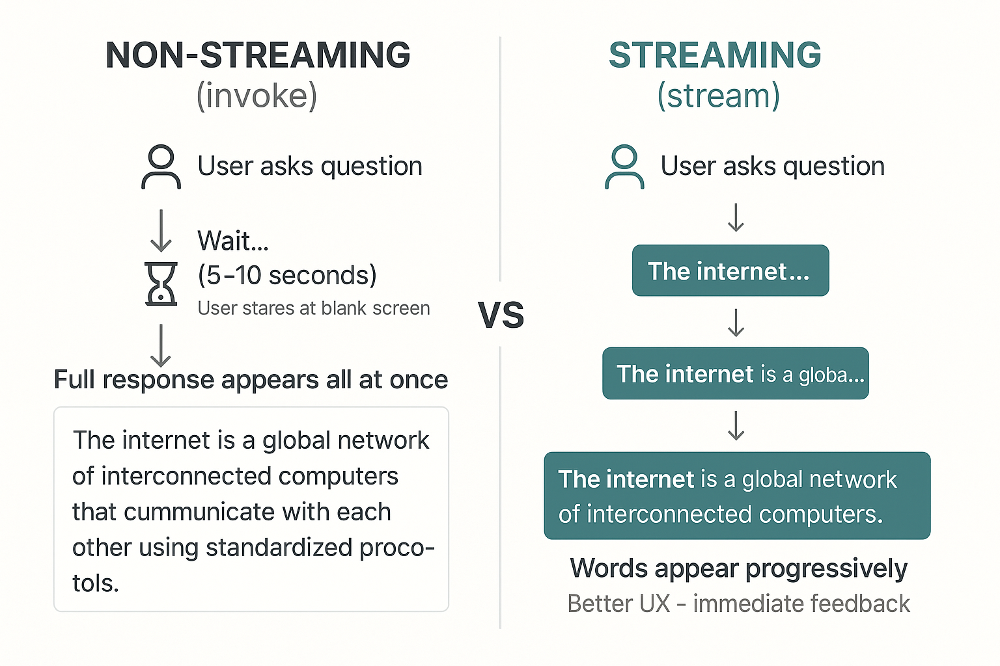

# Chat Models & Basic Interactions

## Multi-Turn Conversations

Conversations having multiple exchanges with LLMs.

### How Conversation History Works

Chat models don't actually "remember" previous messages. Instead, you send the entire conversation history with each new message.

**Think of it like this**: Every time you send a message, you're showing the AI the entire conversation thread so far.



*How the messages list builds up over multiple exchanges - full history sent with each invoke()*

---

### Message Types in LangChain

LangChain provides three core message types for building conversations:

| Type | Purpose | Example |
|------|---------|---------|
| **SystemMessage** | Set AI behavior and personality | `SystemMessage(content="You are a helpful coding tutor")` |
| **HumanMessage** | User input and questions | `HumanMessage(content="What is Python?")` |
| **AIMessage** | AI responses with metadata | Returned by `model.invoke()` with `content`, `usage_metadata` |
| **ToolMessage** | The result of a tool call, sent back to the model. |
| **AIMessageChunk** | Streaming AI responses with metadata 

```python
from langchain_core.messages import SystemMessage, HumanMessage, AIMessage

messages = [
    SystemMessage(content="You are a helpful assistant"),
    HumanMessage(content="Hello!")
]
```

### Streaming Responses
When you ask a complex question, waiting for the entire response can feel slow. Streaming sends the response word-by-word as it's generated.

**Building a chatbot where users ask complex questions.** With regular responses, users stare at a blank screen for 5-10 seconds wondering if anything is happening. With streaming, they see words appearing immediately just like ChatGPT which feels much more responsive even if the total time is the same.



**When streaming a response we use this format in python**

```python
# Stream the response instead of waiting for it all at once
for chunk in model.stream("Explain how the internet works in 3 paragraphs."):
    print(chunk.content, end="", flush=True)  # Display immediately without newline
```
