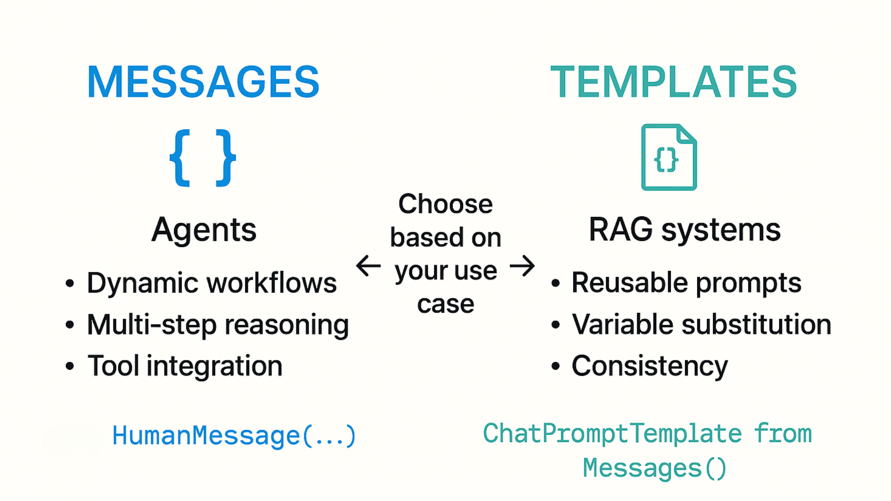
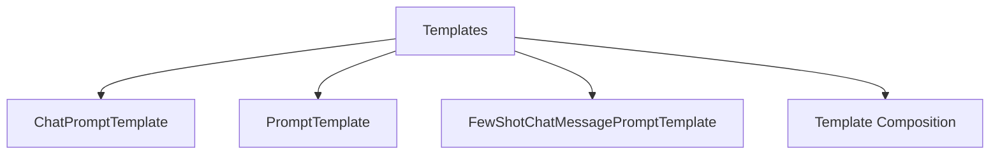
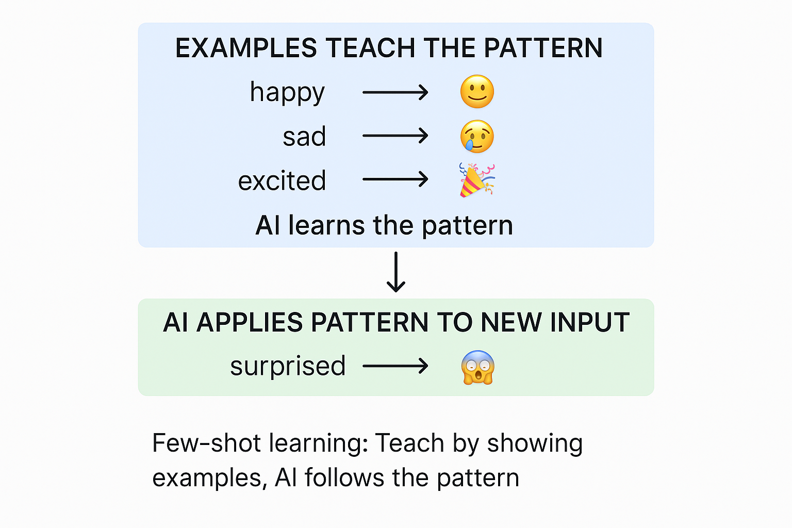
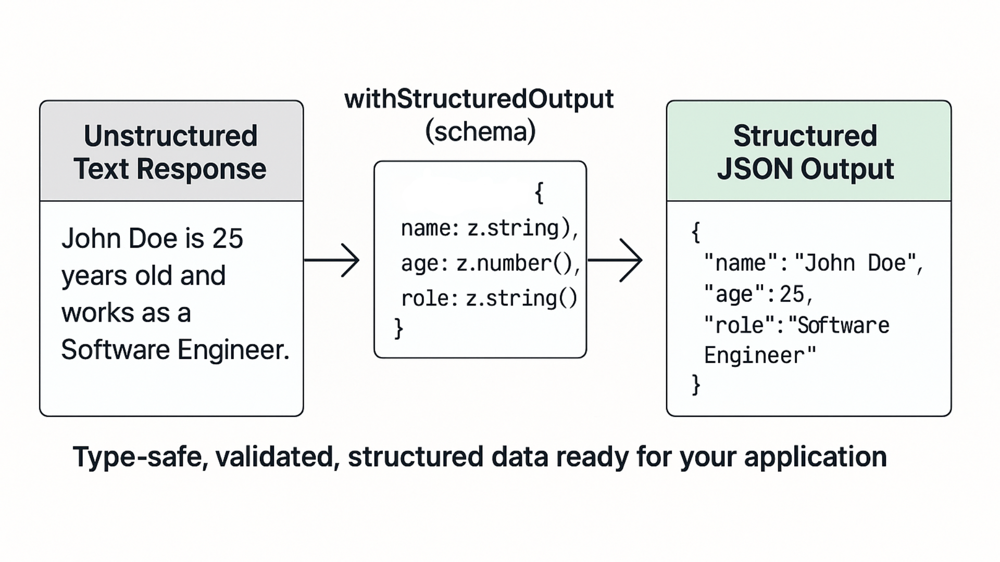
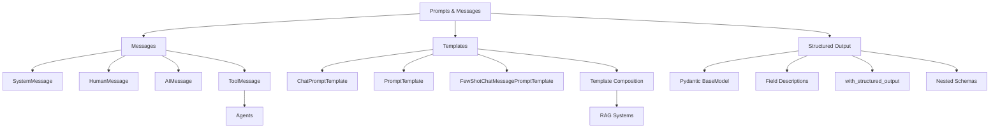

# Prompt Templates VS Messages

| Approach | Use For |
|----------|---------|
| **Messages** | Agents, dynamic workflows, multi-step reasoning, tool integration |
| **Templates** | Reusable prompts, variable substitution, consistency, RAG systems |

**Both approaches are valuable**: Messages for dynamic workflows, templates for reusability and consistency.

---

### Langchain Templates

---

### Few-Shot Prompting with Templates
Teach the AI by providing examples, One of the most powerful prompting techniques.

---

### Template Composition
Build complex prompts by combining smaller templates together.
1. **Base Instructions**: Define common elements used across templates
2. **Specialized Templates**: Add specific instructions for each use case
3. **Compose**: Combine base + specialized + user input

---
---

# Structured Outputs (Pydantic)
Use Pydantic models to get type-safe, structured data from LLMs. This ensures you get exactly the data structure you need.

### Example structured outputs like a form:

- Define the fields (name, email, age)
- The AI fills in the form
- You get validated, typed data back

---

### Steps to get structured LLM response
1. **Define Schema**: Create a Pydantic BaseModel with typed fields
2. **Add Descriptions**: Use Field(description="...") to guide the AI
3. **Create Structured Model**: Call model.with_structured_output(Schema)
4. **Get Typed Data**: Result is a Pydantic model instance with typed attributes

---

### Complex Pydantic Schemas
Build more sophisticated schemas with nested objects, enums, and validation. 

* **Nested Models:** e.g. define Address Model and use it inside Company Model (same like nested Json)
* **Literal Types**: Use Literal["A", "B", "C"] for enum-like constraints
* **Validation**: Pydantic validates types automatically
* **Access Nested Data**: Use dot notation like `result.headquarters.city`

---

## Summary

