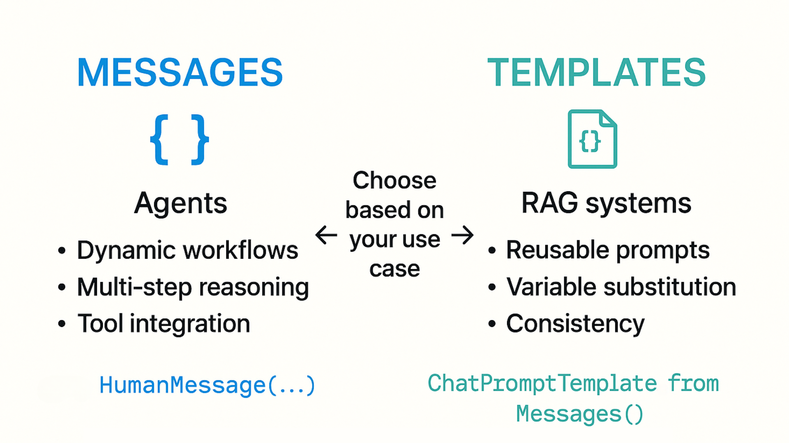
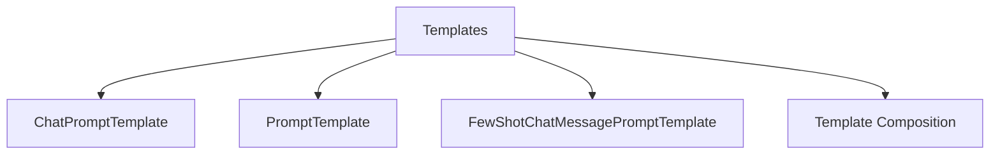
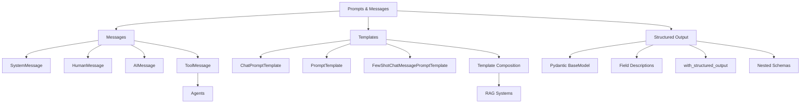

# Prompt Templates VS Messages

| Approach | Use For |
|----------|---------|
| **Messages** | Agents, dynamic workflows, multi-step reasoning, tool integration |
| **Templates** | Reusable prompts, variable substitution, consistency, RAG systems |

**Both approaches are valuable**: Messages for dynamic workflows, templates for reusability and consistency.

---

### Langchain Templates

---

### Few-Shot Prompting with Templates
Teach the AI by providing examples, One of the most powerful prompting techniques.

---

### Template Composition
Build complex prompts by combining smaller templates together.
1. **Base Instructions**: Define common elements used across templates
2. **Specialized Templates**: Add specific instructions for each use case
3. **Compose**: Combine base + specialized + user input

---

## Summary

