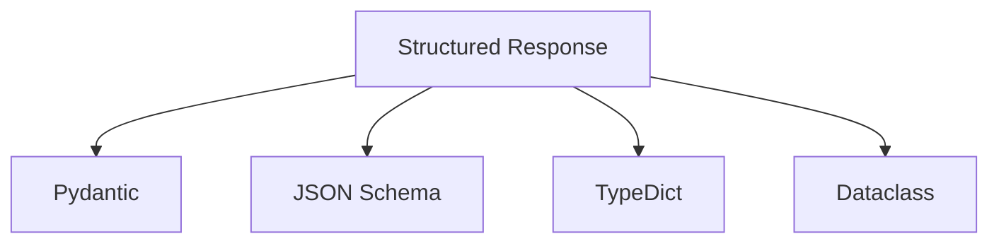
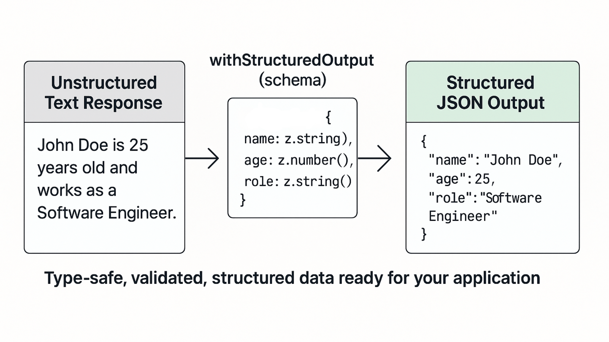
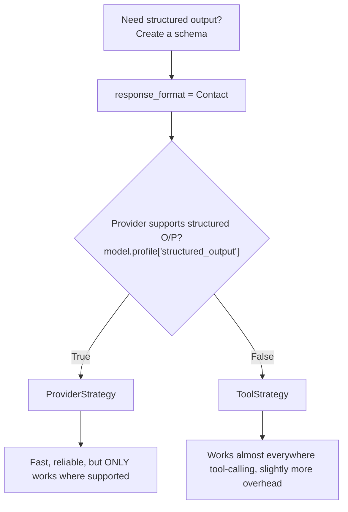

# Structured Outputs | With Models And Agents using Langchain

### Why Structured Output?
Normally, an LLM returns free-text:

```text
John's email is john@gmail.com and his phone is 9876543210.
```

We have to manually write logic to extract the data.

With **Structured Output**, the LLM returns data in a predefined format (Schema), making it easy to use directly in code.

```python
class Contact(BaseModel):
    name: str
    email: str
    phone: str
```

Output:

```python
Contact(
    name="Shivam",
    email="pasrichashivam@gmail.com",
    phone="720666***6"
)
```

**LLM's can be requested for Structured Response using:**
- **Pydantic** (recommended)
- Dataclass
- TypedDict
- JSON Schema



> **Important Considerations:**
>
> - Not all LLMs natively support **Structured Outputs**. Older models (for example, `gpt-3.5-turbo`) or some self-hosted/custom models may only generate text.
> - For simple LLM applications, implementing custom parsing and validation is usually straightforward.
> - In **Agentic workflows**, where multiple agents invoke multiple tools and exchange intermediate results, manual parsing and validation can quickly become complex and error-prone.
> - Using models with native Structured Output support (or LangChain's structured output capabilities) significantly simplifies this process.

| Use Case | Notebook | Comments |
|----------|----------|----------|
| **Structured Outputs with_structured_schema()** | [model_structured_output](01_model_structured_output.ipynb) | Demonstrates how to generate schema-validated responses from a single LLM call |
| **Structured Outputs in Agentic Workflows** | [agent_structured_output](02_agent_structured_output.ipynb) | Shows how Structured Outputs are used within LangChain agents and tool-calling workflows.<br> **Prerequisite:** Understanding of Agents and Tool Calling concepts is recommended before exploring this notebook. |

## [1. Structured Outputs using `with_structured_output`](01_model_structured_output.ipynb)

### Pre-requisite: Pydantic [Practical](https://github.com/pasrichashivam/python-for-ai-data/blob/master/02_pydantic_models/pydantic.ipynb)

* Use Pydantic models to get type-safe, structured data from LLMs. 
* This ensures you get exactly the data structure you need.
* Models can be requested to provide their response in a format matching a given schema. 



### Example structured outputs like a form:

- Define the fields (name, email, age)
- The AI fills in the form
- You get validated, typed data back

---

### Steps to get structured LLM response
1. **Define Schema**: Create a Pydantic BaseModel with typed fields
2. **Add Descriptions**: Use Field(description="...") to guide the AI
3. **Create Structured Model**: Call model.with_structured_output(Schema)
4. **Get Typed Data**: Result is a Pydantic model instance with typed attributes

---

### Complex Pydantic Schemas
Build more sophisticated schemas with nested objects, enums, and validation. 

* **Nested Models:** e.g. define Address Model and use it inside Company Model (same like nested Json)
* **Literal Types**: Use Literal["A", "B", "C"] for enum-like constraints
* **Validation**: Pydantic validates types automatically
* **Access Nested Data**: Use dot notation like `result.headquarters.city`

---
## [2. Structured Outputs with Agents using `create_agent`](02_agent_structured_output.ipynb)

### response_format

The `response_format` parameter tells `create_agent` function **how the model should generate structured data**.

```python
from langchain.agents import create_agent
create_agent(
    model=model,
    response_format=...
)
```

### Strategies to provide for Structured Output
* Pydantic Model: Directly pass Pydantic's BaseModel class e.g. `Contact`.
* ProviderStrategy: Default if model and provider explicitly support structured outputs, check if `model.profile['structured_output']` is True [Can also be explicitly passes to with_structured_output()]
* ToolStrategy: Fallback default for all other models or providers doesn't support schema validation



### 3 Ways to provide response_format.
**Option 1: Pass the Schema e.g. `Contact`**
* Auto mode.
* If the model supports native structured output → uses **ProviderStrategy**
* Otherwise → uses **ToolStrategy**

```python
response_format=Contact
```
**[Option 2: ProviderStrategy](https://docs.langchain.com/oss/python/langchain/structured-output#provider-strategy)**
* The LLM provider (e.g. OpenAI) enforces the schema and guarantees the output matches it.
* Use when you explicitly want to force provider-native structured output.
* Schema validated by provider

```python
from langchain.agents.structured_output import ProviderStrategy
response_format=ProviderStrategy(Contact)
```

**[Option 3: ToolStrategy](https://docs.langchain.com/oss/python/langchain/structured-output#tool-calling-strategy)**
* LangChain asks the model to "call a tool" whose parameters match your schema, then converts the tool arguments into your object.
* Use when the model **doesn't support native structured output**.

```python
from langchain.agents.structured_output import ToolStrategy
response_format=ToolStrategy(Contact)
```
---

#### Usage criteria

| Strategy | Use When |
|---------|----------|
| `response_format=Schema` | Recommended everywhere |
| `ProviderStrategy(Schema)` | Explicitly use provider-native structured output |
| `ToolStrategy(Schema)` | Model doesn't support structured output |


## Key Takeaways

- Structured Output returns typed objects instead of free text.
- Simply pass your schema to `response_format`.
- Use **Pydantic** for defining schemas whenever possible.
