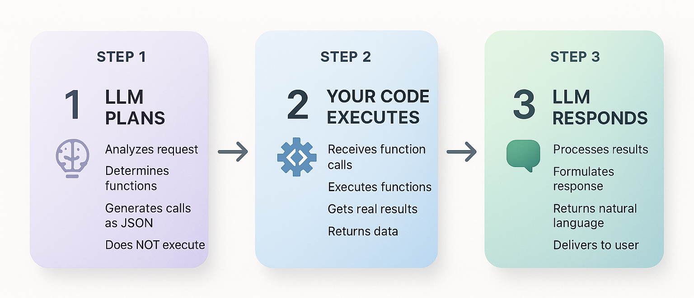
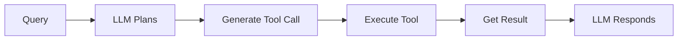
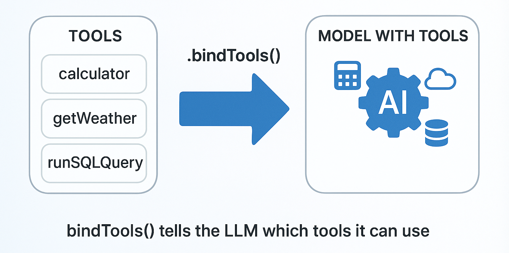

# Tools in Langchain
Tools extend what LLMs can do, Think of LLM as a Brain and Tools as a Specialists.

### Analogy: Project Manager 👩‍💼
*LLM = Project manager*

*Tools = Team members (designer, developer, tester)*

A client requests: "Build a login page."
* The project manager (LLM):
* Assigns the UI to the designer. [Tool 1]
* Assigns implementation to the developer.  [Tool 2]
* Assigns verification to the tester.  [Tool 3]
* Collects everyone's work and elivers the finished product. [LLM respone]

The manager coordinates work but doesn't perform every specialized task personally.

**Function / Tool calling in AI works exactly the same way!**
* The LLM Understands the user's request
* Generates structured function calls with proper arguments
* Returns the function details (but doesn't execute them)
* Processes the function results to form a response

### Understanding the Execution Model

**Critical concept: The LLM never executes functions directly.** Here's what actually happens:

**1. LLM's Role (Planning)**:
- Analyzes user request
- Determines which Tool(s)/function(s) to call
- Generates structured Tool/function calls with arguments
- Returns this as JSON (doesn't execute anything)

**2. Your Code's Role (Doing)**:
- Receives function call descriptions
- Actually executes the Tool/functions
- Gets real results (API calls, calculations, etc.)
- Sends results back to LLM

**3. LLM's Role Again (Communicating)**:
- Incorporates function results into natural response
- Returns helpful answer to user

### Why This Separation Matters

**Security & Control**: Your code decides what functions exist and controls execution. You can reject dangerous operations.



**Example Flow**: "What's the weather in Tokyo and Paris?"
```python
# 1. LLM generates (doesn't execute):
{
    "tool_calls": [
        {"name": "get_weather", "args": {"city": "Tokyo"}},
        {"name": "get_weather", "args": {"city": "Paris"}}
    ]
}

# 2. Your code executes:
tokyo = get_weather("Tokyo")   # → "24°C, sunny"
paris = get_weather("Paris")   # → "18°C, rainy"

# 3. LLM responds:
"Tokyo is 24°C and sunny. Paris is 18°C and rainy."
```



---

## [1. Simple Tool Calling](01_simple_tool_calls.ipynb)

### Below are the end-to-end steps to create and call the Tools

1. Defining the Tool. e.g. Simple Calculator

    **In LangChain Python, tools are created using the @tool decorator with [Pydantic](https://github.com/pasrichashivam/python-for-ai-data/blob/master/02_pydantic_models/pydantic.ipynb) (Optional) schemas for type safety.**

    ```python
    from langchain_core.tools import tool
    # Define input schema with Pydantic
    class CalculatorInput(BaseModel):
        expression: str = Field(description="The mathematical expression to evaluate")

    # Define calculator tool using @tool decorator
    @tool(args_schema=CalculatorInput)
    def calculator(expression: str) -> str:
        """Useful for performing mathematical calculations."""
        result = eval(expression, {"__builtins__": {}}, {})
        return f"The result is: {result}"
    ```

    **What's happening**:
    1. **Define the input schema**: Pydantic `BaseModel` with `Field(description=...)` for parameters
    2. **Create the tool**: Use `@tool(args_schema=...)` decorator to create the tool
    3. **Implement the logic**: The function body contains the actual calculation
    4. **Return result**: String describing the result

2. Binding Tools to Models
    Use `bind_tools()` to make tools available to the LLM.

    **You've created a calculator tool, but how does the AI know it exists?** The tool sits in your code, disconnected from the AI. You need to tell the AI "here are the tools you can use" and let the AI decide when to call them.
    

    ```python
    # Create model and bind tools to it
    model = ChatOpenAI(model='gpt-5-nano')
    model_with_tools = model.bind_tools([calculator])  # Make tool available to LLM
    ```
    **What Happens**:
    1. **LLM sees the tool description**: When we bind the calculator tool, the LLM learns about it
    2. **LLM analyzes the query**: "What is 25 * 17?" → This needs the calculator tool
    3. **LLM generates a tool call**: Returns structured data with tool name, arguments, and ID
    4. **Your code receives the tool call**: `response.tool_calls[0]` contains the structured call
    5. **Next step**: You execute the tool with those arguments

3. Handling Tool Execution: Complete Tool Call Loop
    The complete flow: LLM generates tool call, your code executes the tool, and results return to LLM for the final response.
    
    
    
    ```python
    # Step 1: LLM generates tool call (Planning)
    query = 'What is the temparature in Seattle'
    response1 = model_with_tools.invoke([HumanMessage(content=)])
    tool_call = response1.tool_calls[0]  # {"name": "get_weather", "args": {"city": "Seattle"}}

    # Step 2: YOUR code executes the tool (Doing)
    tool_result = get_weather.invoke(tool_call["args"])

    # Step 3: Send Tool result back to LLM (Refinement)
    messages = [
        HumanMessage(content=query),
        AIMessage(content="", tool_calls=response1.tool_calls),
        ToolMessage(content=tool_result, tool_call_id=tool_call["id"]),
    ]
    final_response = model.invoke(messages)  # "The current temperature in Seattle is 62°F..."
    ```

## [2. Context Aware Tool Calling with Runtime](02_context_aware_tool_calls.ipynb)

