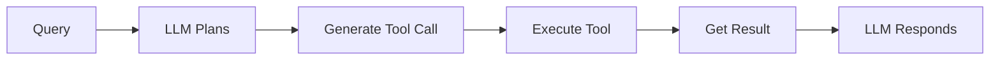
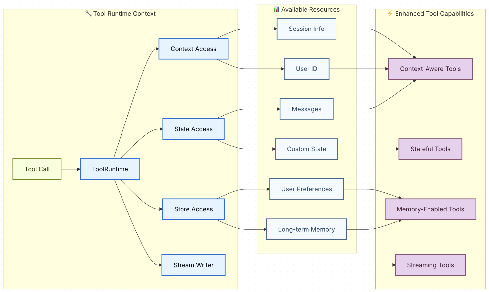

# Tools in Langchain
Tools extend what LLMs can do, Think of LLM as a Brain and Tools as a Specialists.

### Analogy: Project Manager 👩‍💼
*LLM = Project manager*

*Tools = Team members (designer, developer, tester)*

A client requests: "Build a login page."
* The project manager (LLM):
* Assigns the UI to the designer. [Tool 1]
* Assigns implementation to the developer.  [Tool 2]
* Assigns verification to the tester.  [Tool 3]
* Collects everyone's work and elivers the finished product. [LLM respone]

The manager coordinates work but doesn't perform every specialized task personally.

**Function / Tool calling in AI works exactly the same way!**
* The LLM Understands the user's request
* Generates structured function calls with proper arguments
* Returns the function details (but doesn't execute them)
* Processes the function results to form a response

### Understanding the Execution Model

**Critical concept: The LLM never executes functions directly.** Here's what actually happens:

**1. LLM's Role (Planning)**:
- Analyzes user request
- Determines which Tool(s)/function(s) to call
- Generates structured Tool/function calls with arguments
- Returns this as JSON (doesn't execute anything)

**2. Your Code's Role (Doing)**:
- Receives function call descriptions
- Actually executes the Tool/functions
- Gets real results (API calls, calculations, etc.)
- Sends results back to LLM

**3. LLM's Role Again (Communicating)**:
- Incorporates function results into natural response
- Returns helpful answer to user

### Why This Separation Matters

**Security & Control**: Your code decides what functions exist and controls execution. You can reject dangerous operations.


**Example Flow**: "What's the weather in Tokyo and Paris?"
```python
# 1. LLM generates (doesn't execute):
{
    "tool_calls": [
        {"name": "get_weather", "args": {"city": "Tokyo"}},
        {"name": "get_weather", "args": {"city": "Paris"}}
    ]
}

# 2. Your code executes:
tokyo = get_weather("Tokyo")   # → "24°C, sunny"
paris = get_weather("Paris")   # → "18°C, rainy"

# 3. LLM responds:
"Tokyo is 24°C and sunny. Paris is 18°C and rainy."
```



---

## [1. Simple Tool Calling](01_simple_tool_calls.ipynb)

### Below are the end-to-end steps to create and call the Tools

1. Defining the Tool. e.g. Simple Calculator

    **In LangChain Python, tools are created using the @tool decorator with [Pydantic](https://github.com/pasrichashivam/python-for-ai-data/blob/master/02_pydantic_models/pydantic.ipynb) (Optional) schemas for type safety.**

    ```python
    from langchain_core.tools import tool
    # Define input schema with Pydantic
    class CalculatorInput(BaseModel):
        expression: str = Field(description="The mathematical expression to evaluate")

    # Define calculator tool using @tool decorator
    @tool(args_schema=CalculatorInput)
    def calculator(expression: str) -> str:
        """Useful for performing mathematical calculations."""
        result = eval(expression, {"__builtins__": {}}, {})
        return f"The result is: {result}"
    ```

    **What's happening**:
    1. **Define the input schema**: Pydantic `BaseModel` with `Field(description=...)` for parameters
    2. **Create the tool**: Use `@tool(args_schema=...)` decorator to create the tool
    3. **Implement the logic**: The function body contains the actual calculation
    4. **Return result**: String describing the result

2. Binding Tools to Models
    Use `bind_tools()` to make tools available to the LLM.

    **You've created a calculator tool, but how does the AI know it exists?** The tool sits in your code, disconnected from the AI. You need to tell the AI "here are the tools you can use" and let the AI decide when to call them.
    

    ```python
    # Create model and bind tools to it
    model = ChatOpenAI(model='gpt-5-nano')
    model_with_tools = model.bind_tools([calculator])  # Make tool available to LLM
    ```
    **What Happens**:
    1. **LLM sees the tool description**: When we bind the calculator tool, the LLM learns about it
    2. **LLM analyzes the query**: "What is 25 * 17?" → This needs the calculator tool
    3. **LLM generates a tool call**: Returns structured data with tool name, arguments, and ID
    4. **Your code receives the tool call**: `response.tool_calls[0]` contains the structured call
    5. **Next step**: You execute the tool with those arguments

3. Handling Tool Execution: Complete Tool Call Loop
    The complete flow: LLM generates tool call, your code executes the tool, and results return to LLM for the final response.
    
    
    
    ```python
    # Step 1: LLM generates tool call (Planning)
    query = 'What is the temparature in Seattle'
    response1 = model_with_tools.invoke([HumanMessage(content=)])
    tool_call = response1.tool_calls[0]  # {"name": "get_weather", "args": {"city": "Seattle"}}

    # Step 2: YOUR code executes the tool (Doing)
    tool_result = get_weather.invoke(tool_call["args"])

    # Step 3: Send Tool result back to LLM (Refinement)
    messages = [
        HumanMessage(content=query),
        AIMessage(content="", tool_calls=response1.tool_calls),
        ToolMessage(content=tool_result, tool_call_id=tool_call["id"]),
    ]
    final_response = model.invoke(messages)  # "The current temperature in Seattle is 62°F..."
    ```

## [2. Context Aware Tools with Runtime](02_context_aware_tool_calls.ipynb)

* In newer version Langchain changes the way how tools receive information from the agent. 
* Instead of passing everything manually, LangChain introduced ToolRuntime, which gives tools access to the execution context.
    * **Old way:** You had to pass every information (memory, user ID, state, store, config) as function arguments.
    * **New way:** LangChain automatically provides a **ToolRuntime** object that contains everything the tool might need.

### Langchain Provides 2 Reserved arguments for Tools
| Parameter name | Purpose |
|----------|---------------|
| config  | Reserved for passing RunnableConfig to tools internally |
| runtime: ToolRuntime | Reserved for ToolRuntime parameter (accessing state, context, store) |

**Information in these parameters will NOT BE VISIBLE TO LLMs**
* If we bind or pass these tools to our Agent, information in these 2 parameters will be hidden from LLM.
* So if we have some secret information or user_ids etc, we can use ToolRuntime to hide that information.

Instead of passing information by writing
```python
    def get_orders(user_id, db):
        ...
```
We write: 
```python
    def get_orders(runtime: ToolRuntime):
        runtime.state  # Short-term memory - mutable data: Access conversation history, track tool call counts
        runtime.store  # Long-term memory - Save user preferences, maintain knowledge base
        runtime.context # Personalize responses based on user identity e.g runtime.context.user_id
        runtime.config # Access callbacks, tags, and metadata
        runtime.stream_writer # Emit real-time updates during tool execution
        runtime.execution_info # Process and retry information for the current execution (thread ID, run ID, attempt number)
        runtime.tool_call_id # 
```


---

### Access context
#### Short-term memory (State)
* State represents short-term memory that exists for the duration of a conversation. 
* It includes the message history and any custom fields.
    * Tools can access the current conversation state using `runtime.state`
    * Use `Command` to update the agent’s state.
        * Return a Command when the tool needs to update graph state e.g. setting user preferences. 
        * If the model needs to see that the tool succeeded e.g. to confirm a preference change.
        * Include a ToolMessage in the update, using `runtime.tool_call_id` for the `tool_call_id` parameter.
          ```python
            return Command(
                update={
                    "preferred_language": language,
                    "messages": [
                        ToolMessage(
                            content=f"Language set to {language}.",
                            tool_call_id=runtime.tool_call_id,
                        )
                    ],
                }
            )
            ```

#### Context
* Context provides immutable configuration data that is passed at invocation time. 
* Use it for user IDs, session details, or application-specific settings that shouldn’t change during a conversation.
* Access context through `runtime.context`.
* Pass it alongside a `thread_id` so the conversation is persisted across turns.

#### Long-term memory (Store)
* Persistent storage that survives across conversations.
* Data saved to the store remains available in future sessions.
* Access the store through `runtime.store`. The store uses a namespace/key pattern to organize data
* **For production deployments, use persistent store implementation like `PostgresStore` instead of `InMemoryStore`**

#### Stream writer
* Stream real-time updates from tools during execution. 
* For providing progress feedback to users during long-running operations
* Use `runtime.stream_writer` to emit custom updates

#### Execution info
* Access thread ID, run ID, and retry state from within a tool via `runtime.execution_info`

#### Error handling
* Handle tool errors using LangChain agent `middleware` to retry failed tool calls or return custom error messages

#### Dynamic tool selection

#### Headless tools


