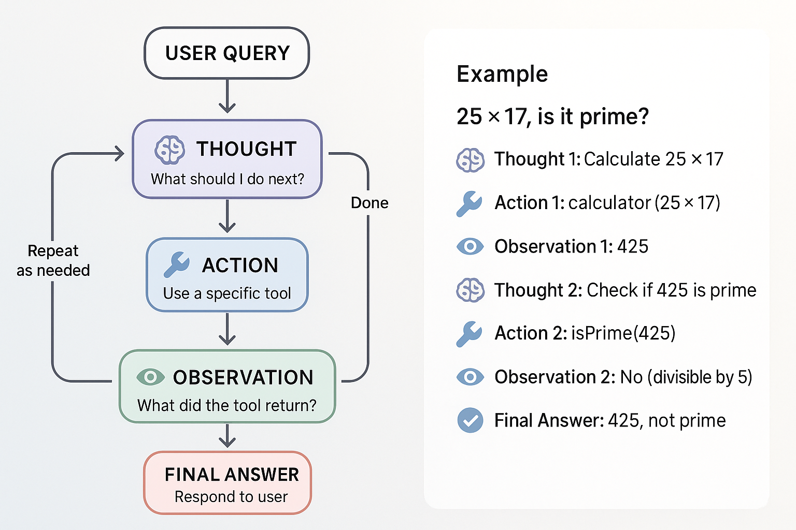

# Agents In Langchain
Build AI agents that can:
* Reason about problems
* Select appropriate tools
* Work iteratively towards solutions. 

Building **ReAct (Reasoning + Acting) pattern** by implementing **agentic loops** step-by-step, and discover how agents autonomously choose tools to accomplish complex tasks.

**Using Manager's Analogy Again to Compare with Agents**
Managers:
- **Think** about what needs to be done (Reasoning)
- **Choose** the right developer (Decision Making)
- **Use** assign work to developer (Acting)
- **Evaluate** the work done by developers (Observation)
- **Repeat** until they achieve the Goal
- **Respond** to the client.

**AI Agents work the same way!**
Agents:
- **Think** about what needs to be done (Reasoning)
- **Choose** the right tool (Decision Making)
- **Use** the tool (Acting)
- **Evaluate** the result (Observation)
- **Repeat** until they have the answer
- **Respond** to the user


---

## The ReAct Pattern / Agentic Loop

ReAct = **Rea**soning + **Act**ing

Agents follow this iterative loop:

```
1. Thought: What should I do next?
2. Action: Use a specific tool
3. Observation: What did the tool return?
4. (Repeat 1-3 as needed)
5. Final Answer: Respond to the user
```

