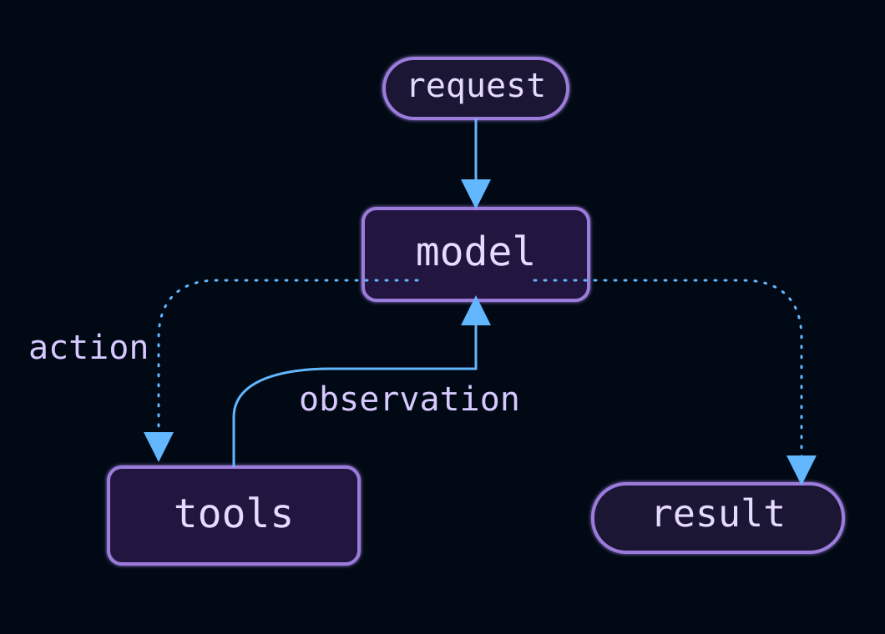
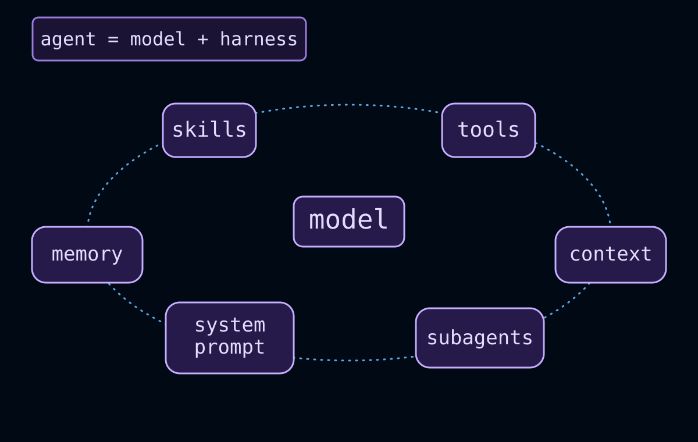
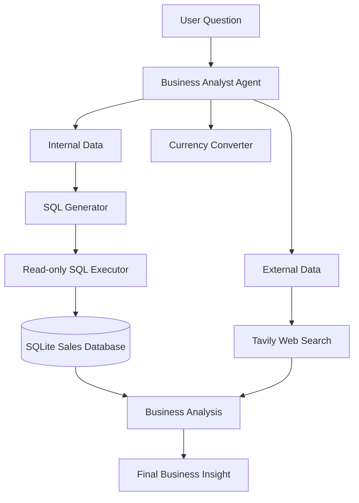

# Agents In Langchain
An agent is a model calling tools in a loop until a given task is complete



## Agent = Model + Harness
**A harness is everything around that loop.**

**The model** is the raw language model — GPT, Claude, Gemini, whatever you plug in. 
**The harness** is everything that turns that raw capability into something useful:
- The **system prompt** — instructions on how the agent should behave
- The **tools** — what it's actually allowed to reach for and use
- The **middleware** — checkpoints that shape its behavior at every step



Build AI agents that can:
* Reason about problems
* Select appropriate tools
* Work iteratively towards solutions. 

Building **ReAct (Reasoning + Acting) pattern** by implementing **agentic loops** step-by-step, and discover how agents autonomously choose tools to accomplish complex tasks.

---

## The ReAct Pattern / Agentic Loop

ReAct = **Rea**soning + **Act**ing

Agents follow this iterative loop:

```
1. Thought: What should I do next?
2. Action: Use a specific tool
3. Observation: What did the tool return?
4. (Repeat 1-3 as needed)
5. Final Answer: Respond to the user
```


---

## [Business Analyst Agent](01_business_analyst_agent.ipynb)
Build a Business Analyst Agent to answer below user questions: 
* Analyze internal sales data stored in SQLite.
* Convert natural-language business questions into SQL queries.
* Execute read-only SQL queries against the sales database.
* Analyze revenue, sales, products, countries, categories, and trends.
* Calculate and discuss year-over-year business performance.
* Convert monetary values between currencies.
* Search external sources for market and competitor information.
* Use different user contexts and roles, such as Business Analyst and Market Analyst.
* Support follow-up questions that build upon previous analysis.

