# Middlewares In Langchain

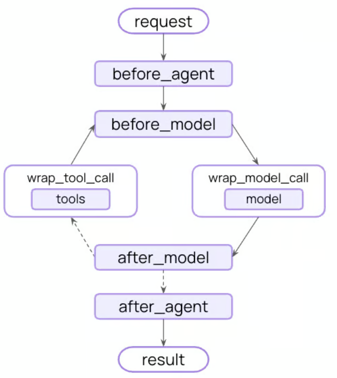

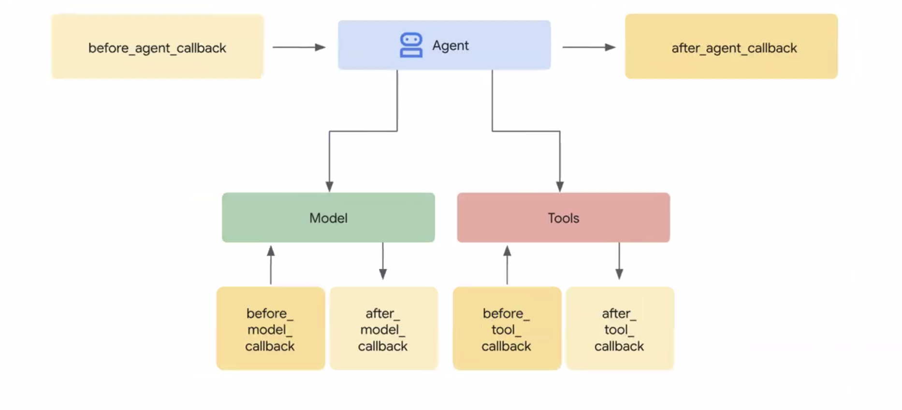


| Middleware            | Description                                                                                   |
| --------------------- | --------------------------------------------------------------------------------------------- |
| Tool error            | Catch tool execution exceptions and convert them to error messages for the model.             |
| Tool retry            | Automatically retry failed tool calls with exponential backoff.                               |
| Model retry           | Automatically retry failed model calls with exponential backoff.                              |
| Model fallback        | Automatically fallback to alternative models when primary fails.                              |
| Summarization         | Automatically summarize conversation history when approaching token limits.                   |
| Human-in-the-loop     | Pause execution for human approval of tool calls.                                             |
| Model call limit      | Limit the number of model calls to prevent excessive costs.                                   |
| Tool call limit       | Control tool execution by limiting call counts.                                               |
| PII detection         | Detect and handle Personally Identifiable Information (PII).                                  |
| To-do list            | Equip agents with task planning and tracking capabilities.                                    |
| LLM tool selector     | Use an LLM to select relevant tools before calling main model.                                |
| Provider tool search  | Defer tools behind providers’ server-side tool search, surfacing them on demand.              |
| Shell tool            | Expose a persistent shell session to agents for command execution.                            |
| Filesystem            | Provide agents with a filesystem for storing context and long-term memories.                  |
| Subagent              | Add the ability to spawn subagents.                                                           |
| Rubric grading (Beta) | Apply LLM-as-a-judge grading so agents self-evaluate and iterate until a rubric is satisfied. |
| File search           | Provide Glob and Grep search tools over filesystem files.                                     |
| Context editing       | Manage conversation context by trimming or clearing tool uses.                                |
| LLM tool emulator     | Emulate tool execution using an LLM for testing purposes.                                     |


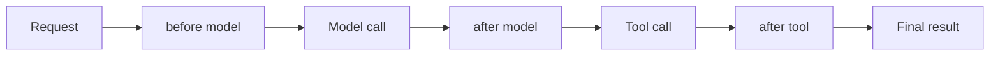

---

### 1. SummarizationMiddleware

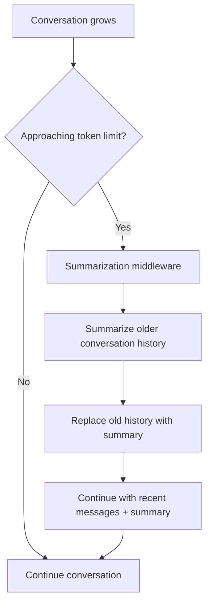

```python
    middleware=[
            SummarizationMiddleware(
                model="openai:gpt-5-nano",
                trigger=("tokens", 300),
                keep=("messages", 1),
            )
        ]
```

---

### 2. HumanInTheLoopMiddleware (HITL)

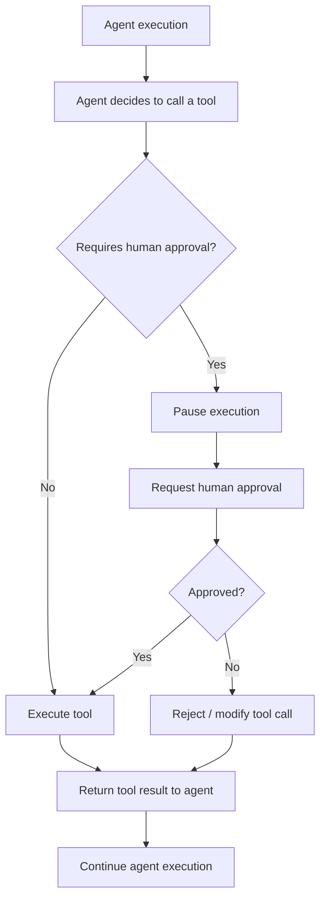

```python
    middleware=[
        HumanInTheLoopMiddleware(
            interrupt_on={"cancel_booking": {"allowed_decisions": ["approve", "edit", "reject", "respond"]}},
        ),
    ]
```

### 3. ModelCallLimitMiddleware

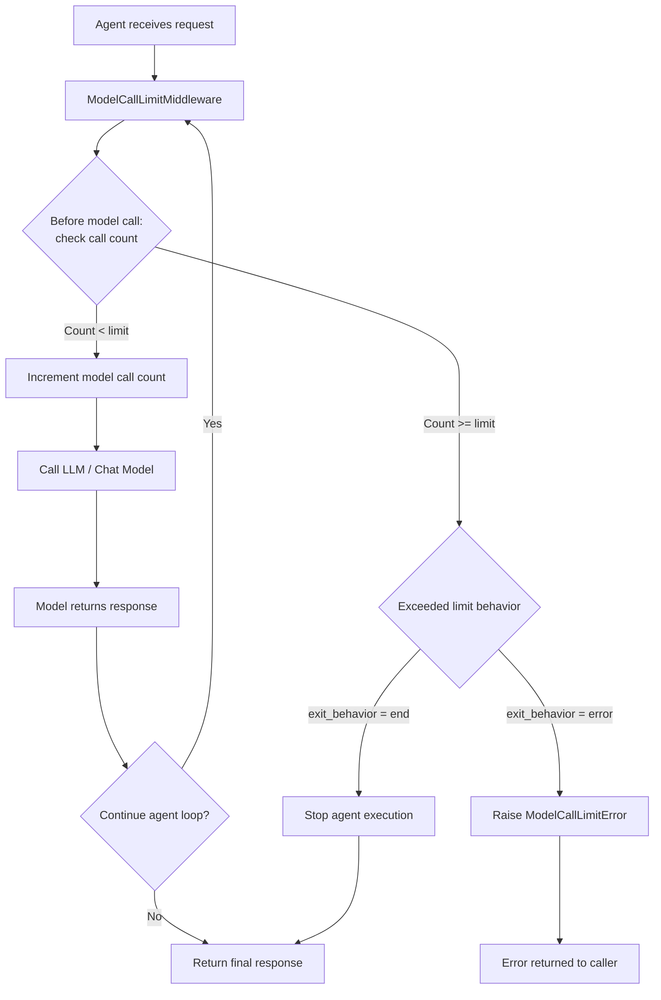

```python
    middleware=[
        ModelCallLimitMiddleware( 
            thread_limit=5,   
            exit_behavior="end",
        ),
    ]
```

### 4. ModelFallbackMiddleware

flowchart TD
    A[Agent Request] --> B[Primary Model]
    B -->|Success| E[Response]
    B -->|Failure| C[Fallback Model 1]
    C -->|Success| E
    C -->|Failure| D[Fallback Model 2]
    D -->|Success| E
    D -->|Failure| F[Error]

```python
    middleware=[
        ModelFallbackMiddleware(
            "openai:gpt-5-nano"
        ),
    ]
```
### 5. ToolCallLimitMiddleware

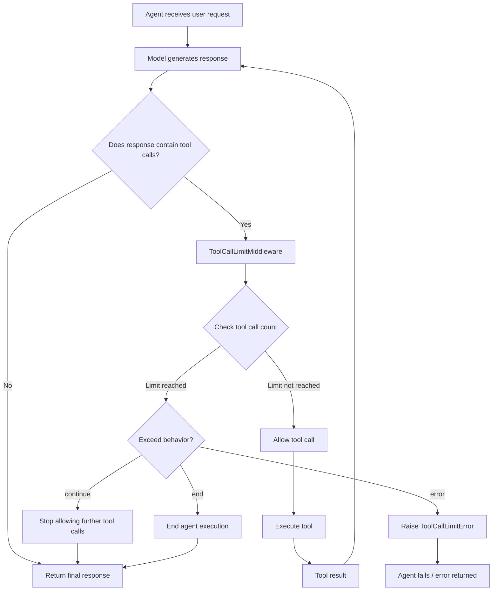

```python
    middleware=[
        ToolCallLimitMiddleware(run_limit=8),
        ToolCallLimitMiddleware(tool_name="cancel_booking", thread_limit=2, run_limit=1),  # tighter, one tool, whole conversation
    ]
```

### 6. PIIMiddleware

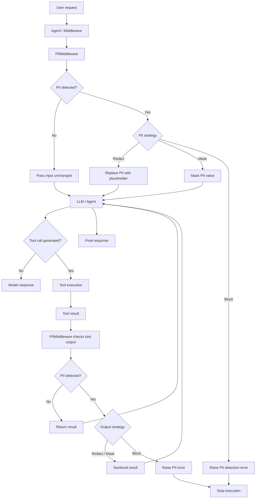

```python
    middleware=[
        ToolCallLimitMiddleware(run_limit=8),
        ToolCallLimitMiddleware(tool_name="cancel_booking", thread_limit=2, run_limit=1),  # tighter, one tool, whole conversation
    ]
```

### 7. TodoListMiddleware

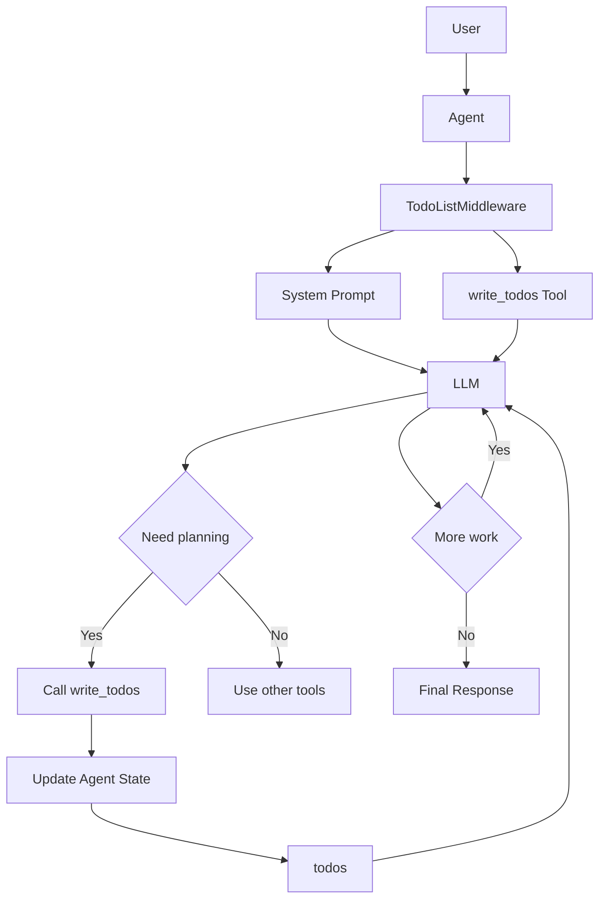

```python
    middleware=[TodoListMiddleware()]
```

### 8. LLMToolSelectorMiddleware

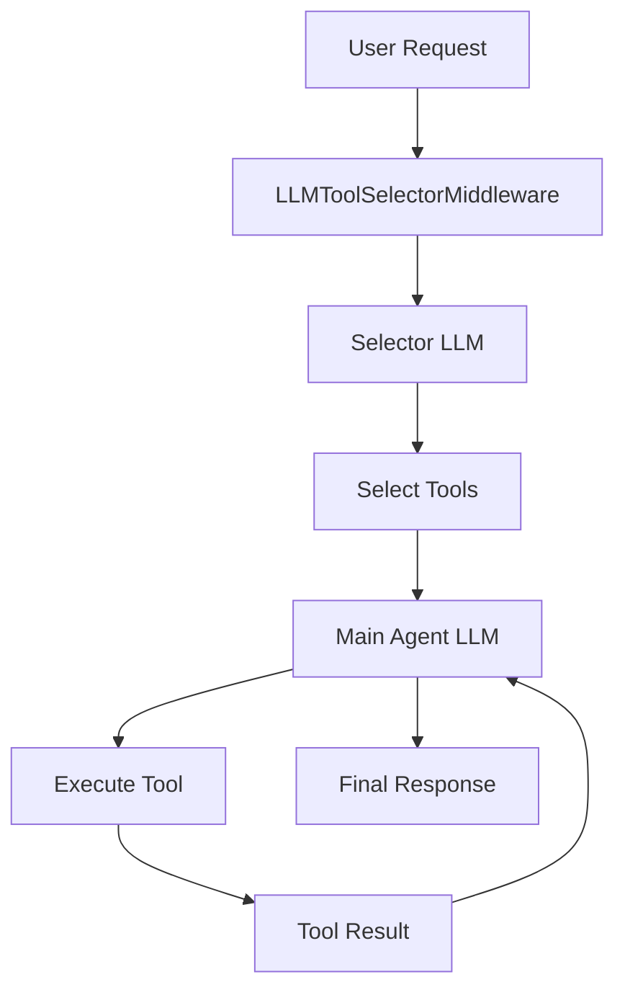

### 9. ToolErrorMiddleware

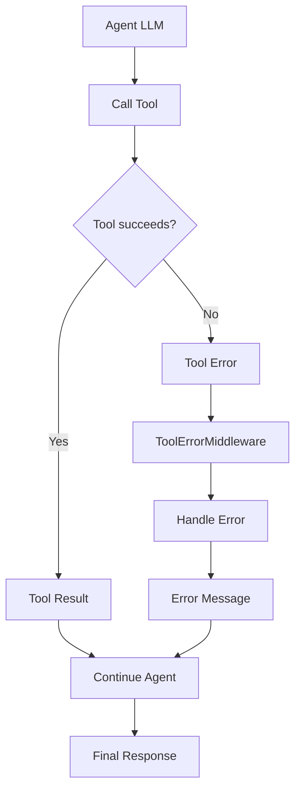

### 11. ToolRetryMiddleware

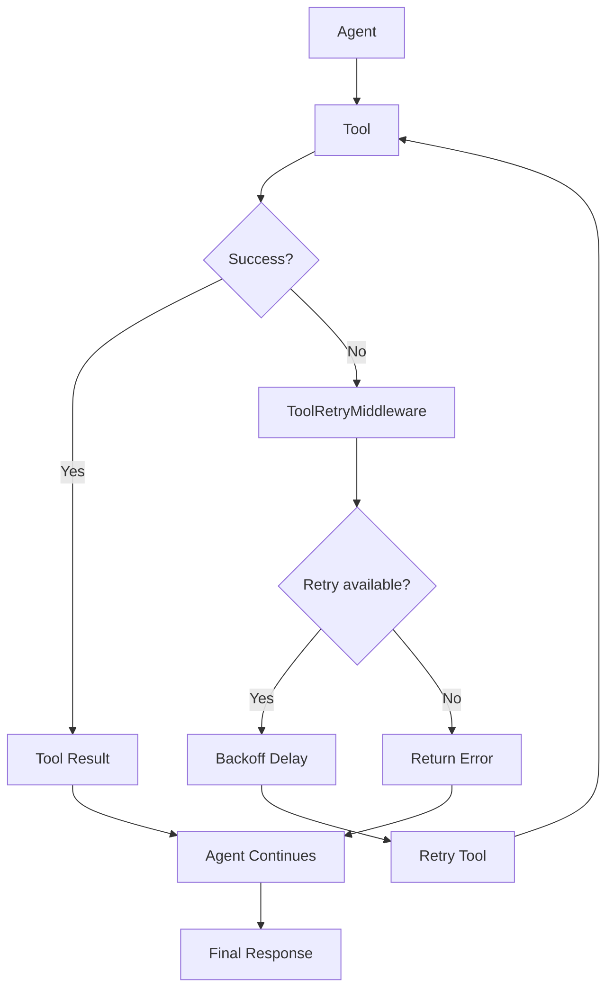

### 11. LLMToolEmulator

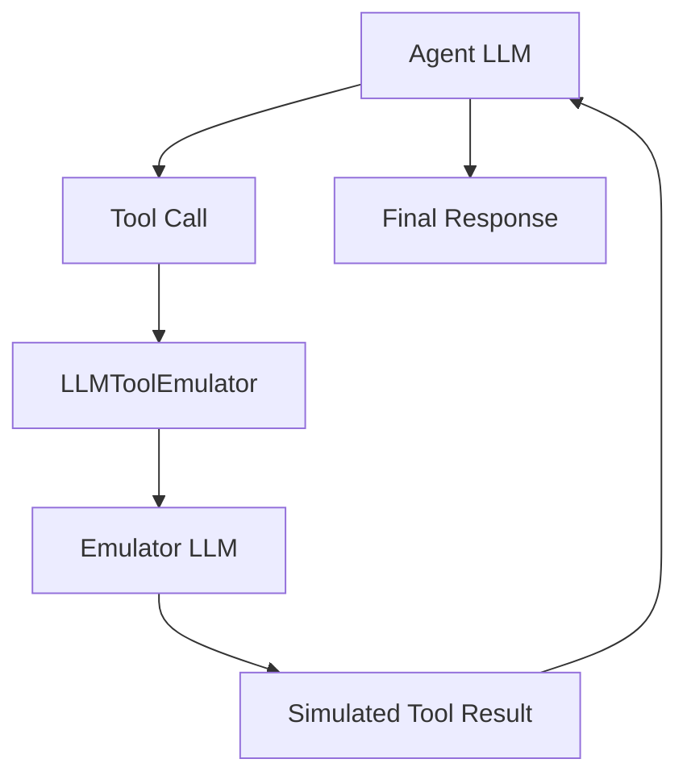

