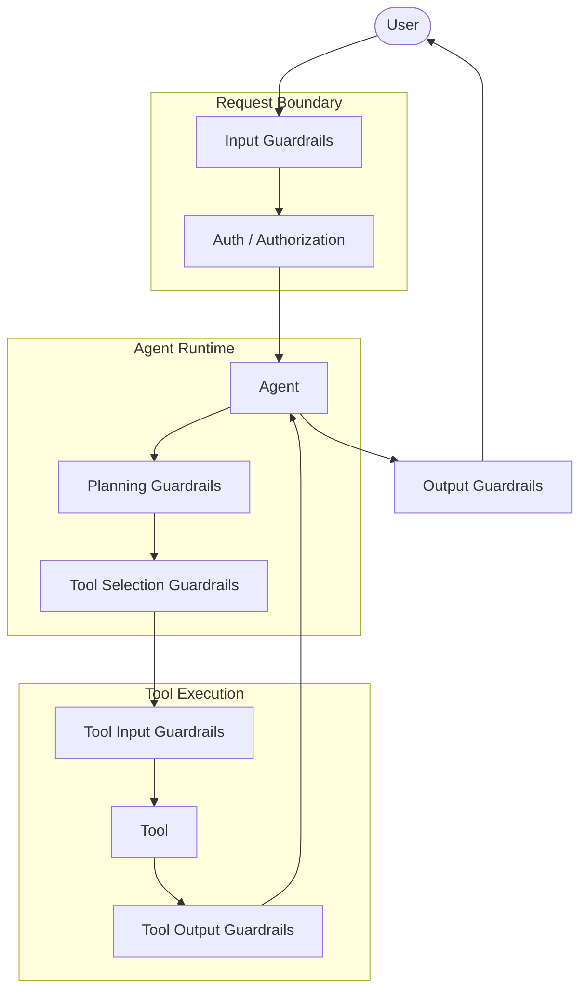

# Guardrails
* Guardrails help to build safe, compliant AI applications by validating and filtering content at key points in agent’s execution
* Can detect sensitive information, validate outputs, and prevent unsafe behaviors before they cause problems.

## Guardrails can be implemented using two approaches:
1. **Deterministic guardrails**
    * Use rule-based logic like regex patterns, keyword matching, or explicit checks. 
    * Fast, predictable, and cost-effective, but may miss nuanced violations.
2. **Model-based guardrails**
    * Use LLMs or classifiers to evaluate content with semantic understanding. 
    * Catch subtle issues that rules miss, but are slower and more expensive.

## A useful rule of thumb
* Guardrails before the LLM → control what the model sees.
* Guardrails inside the agent loop → control what the model can decide.
* Guardrails before tools → control what the agent can do.
* Guardrails after tools → control what external systems return.
* Guardrails between agents → control delegation.
* Guardrails after the LLM → control what reaches the user.
* Authorization should never be delegated entirely to the LLM—enforce it in deterministic application code.

## Exhastive Guardrails Categories
* User input / entry point
    * Prompt-injection detection
    * Toxicity / hate / harassment filtering
    * PII detection: email, phone, Aadhaar, SSN, credit card
    * Input length/token limits
    * Allowed-topic / domain validation
    * URL/domain allowlist
* Before sending user input to the LLM
    * Redact PII
    * Detect prompt injection.
    * Enforce maximum context size
    * System prompt / prompt construction
    * Define allowed tools
    * SQL query validation (Reject dangerous queries)
* LLM output guardrail
    * JSON/schema validation
    * Pydantic validation
    * PII leakage detection
    * Secret/API-key detection
    * Financial/legal/medical disclaimer requirements where appropriate
    * Hallucination detection
    * Toxicity/ hate / harassment check
* Before tool execution
    * Check user authorization
    * Rate-limit tool calls
    * Check whether human approval is required
    * SQL injection detection
    * Shell Terminal injection detection
    * API endpoint allowlisting
    * File-path allowlisting
    * Payload-size limits
* Tool execution
    * Timeout
    * Rate limiting
    * API quota
* After tool execution
    * Check response schema
    * Detect malicious content returned by tools
    * Remove sensitive fields
    * Validate database results
    * Limit returned rows
    * Limit response size
    * Custom validations on external API response
* Memory Guardrails
    * Don't store passwords
    * Don't store API keys
    * Don't store unnecessary PII
    * Memory TTL
    * Memory size limits
    * User-level isolation
* Conversation history Guardrails
    * Maximum history size
    * PII redaction
    * Sensitive-topic filtering
    * Old-messages summarization
    * Prevent untrusted tool output from becoming trusted instructions
* Human-in-the-loop Guardrails that Require approval before:
    * Financial transactions
    * Account deletion
    * Password changes
    * Sending email
    * Deleting data
    * Updating production records
    * Publishing content
    * Booking travel
    * Placing an order
    * Executing production code
    * Permission changes
    * Production deployments
    * Database mutations
    * Security-sensitive operations
* API / external service guardrails
    * API allowlist
    * Domain allowlist
    * Authentication
    * OAuth scopes
    * Rate limits
    * Request quotas
    * Timeout
    * Retry limits
    * Response-size limits
* SQL/database agents
    * Read-only default
    * Table allowlist based on user role
    * Column allowlist based on user role
    * Row-level security
    * Block DROP, TRUNCATE, DELETE
    * Require WHERE for UPDATE/DELETE
    * Query timeout
    * Result-row limit
    * Query-cost limit
* Rate limiting
    * Requests/user/minute
    * Agent runs/user/day
    * Tool calls/minute
    * API calls/minute
    * Token budget/run
    * Cost budget/run
    * Maximum concurrent agents
* Cost guardrails
    * Token budget
    * Model-selection limits
    * Maximum retries
    * Maximum agent iterations
    * Maximum tool calls
    * Maximum execution time
    * Budget per user
    * Budget per workflow
* Output to the end user
    * PII redaction
    * Secret/API-key redaction
    * Toxicity filtering
    * Sensitive-information filtering
* Fallback / recovery guardrails
    *  Safe fallback response
    * Switch to deterministic logic
    * Escalate to human
    * Disable risky tool
