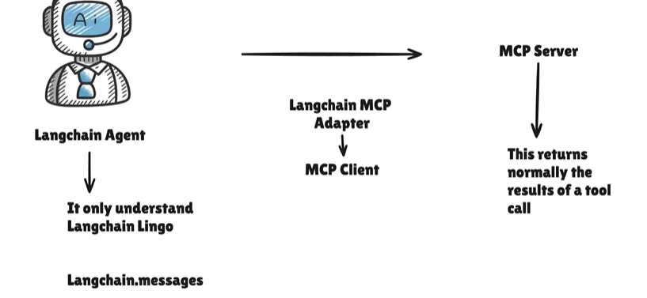

# Model Context Protocol (MCP)
* Model Context Protocol (MCP) standardizes how applications provide tools and context to language models.
* LangChain agents call tools defined on MCP servers through **MCPAdapter**, which discovers a server’s tools and adapts them into LangChain tools that can pass straight to create_agent.

### Installation
```sh
    uv add "langchain[mcp]" fastmcp
```
## MCPAdapter
* `MCPAdapter` is built on `FastMCP`, which handles transport inference, protocol negotiation, connection management, and authentication. 
* It then converts discovereds MCP tools with `list_tools()` into asynchronous LangChain tools.
* The resulting tools can be passed directly to create_agent.
* Langchain MCP Adapter is Universal Tranlator i.e. One Adaptor and it figures out on its own whether its talking to Local MCP over HTTP.




    ```python
    from langchain.agents import create_agent
    from langchain.mcp import MCPAdapter
    async def main():
    async with MCPAdapter("https://docs.langchain.com/mcp") as adapter:
        tools = await adapter.list_tools()
        agent = create_agent("gpt-5-mini", tools)
        return await agent.ainvoke({
                "messages": [{"role": "user", "content": "How do I add short-term memory to a LangChain agent?"}]}
                )
    ```

## Transports
* `MCPAdapter` infers the `transport` from the target provided to it.
* A target can be any of the following:
    * **http/https URL (str)**: reached over streamable HTTP.
    * **script path (Path)**: launched as a subprocess over stdio.
    * **A transport object (StreamableTransport)**: a pre-configured transport object.
    * **An in-process FastMCP server**: connected in-memory, with no subprocess or socket.
    * **An MCPConfig dict ({"mcpServers": {...}})**: several servers behind one adapter.
    * **A prebuilt fastmcp.Client**: for full control over transport, caching, and protocol negotiation.

    ```python
    from pathlib import Path
    from langchain.mcp import MCPAdapter
    # An in-process FastMCP server: no subprocess, no socket. Ideal for tests.
    in_memory = MCPAdapter(server)  # a FastMCP instance
    # A script path is launched over stdio, one subprocess per adapter.
    stdio = MCPAdapter(Path("weather_server.py"))
    # A string must be an http(s) URL, reached over streamable HTTP.
    http = MCPAdapter("https://example.com/mcp")
    ```

## Tools

## Connections
* MCPAdapter opens an MCP connection, discovers tools, and returns LangChain tools your agent can call
* The connection itself is FastMCP’s

#### Connection lifecycle
* `MCPAdapter` is an async context manager. Entering it connects the underlying client; exiting it releases the connection. 

### Multiple servers
* To give one agent tools from several servers, choose 
    * `MCPConfig` when a single aggregate connection is enough
    * `ClientGroup` when each server needs its own connection (per-server authentication, or a shared pool configured per client).

**One aggregate connection with MCPConfig**
* Give the adapter an MCPConfig dict to connect to several servers behind one aggregate endpoint
    ```python
    from langchain.agents import create_agent
    from langchain.mcp import MCPAdapter
    CONFIG = {
        "mcpServers": {
            "weather": {"command": "python", "args": ["/path/to/weather_server.py"]},
            "calc": {"command": "python", "args": ["/path/to/calc_server.py"]},
        }
    }

    async def fleet_agent(config):
        async with MCPAdapter(config) as adapter:
            # Every tool is prefixed with its config key (`weather_...`, `calc_...`),
            # so two servers exposing the same tool name stay distinguishable.
            tools = await adapter.list_tools()
            return create_agent("claude-sonnet-5", tools)
    ```

**Independent connections with ClientGroup**
* To keep each server on its own connection, pass a `ClientGroup`. 
* Each connection keeps its own negotiated protocol era, authentication, and the group routes each call back to the client that advertised the tool. 

    ```python
    from fastmcp.client import Client
    from fastmcp.client.group import ClientGroup
    from langchain.agents import create_agent
    from langchain.mcp import MCPAdapter
    async def agent_from_group(legacy_url: str, modern_url: str):
        # One connection per server: a `ClientGroup` keeps each server on its own
        # negotiated protocol era, so a legacy and a modern server run side by side.
        # It also namespaces every tool as `{server}_{tool}`, so two servers exposing
        # the same tool name stay distinct.
        group = ClientGroup({"weather": Client(legacy_url, mode="legacy"),"calc": Client(modern_url, mode="auto")})
        async with MCPAdapter(group) as adapter:
            tools = await adapter.list_tools()
            return create_agent("claude-sonnet-5", tools)
    ```

## Authentication
