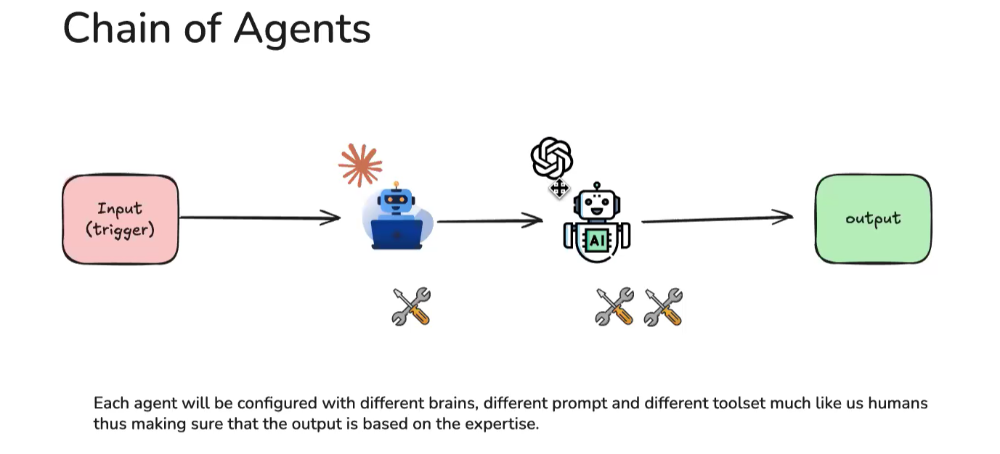
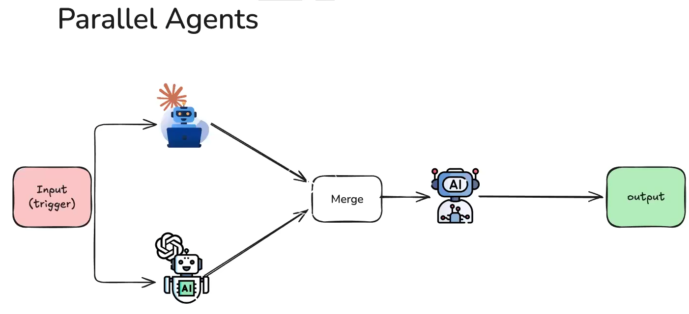
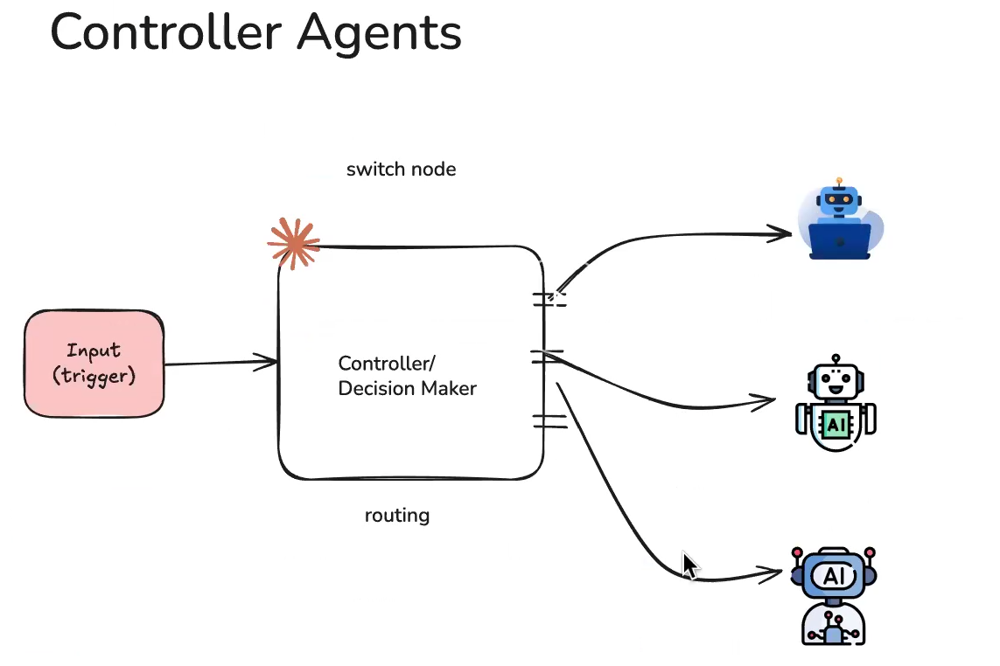

# Multi Agent
* Multi-agent systems coordinate specialized components to tackle complex workflows. 

## Why multi-agent?
* Multi-agents are used for one or more of these capabilities:
    * **Context management**: 
        * Provide specialized knowledge without overwhelming the model’s context window. 
        * If context were infinite and latency zero, you could dump all knowledge into a single prompt
        * **Context Isolation** helps to provide task specific context to sub agents to selectively surface relevant information.
    * **Distributed development:** Allow different teams to develop and maintain capabilities independently, composing them into a larger system with clear boundaries.
    * **Parallelization**: Spawn specialized workers for subtasks and execute them concurrently for faster results.

## Patterns
Here are the main patterns for building multi-agent systems, each suited to different use cases:

| Pattern | How it works |
| --- | --- |
| Subagents | A main agent coordinates subagents as tools. All routing passes through the main agent, which decides when and how to invoke each subagent. |
| Handoffs | Behavior changes dynamically based on state. Tool calls update a state variable that triggers routing or configuration changes, switching agents or adjusting the current agent’s tools and prompt. |
| Skills | Specialized prompts and knowledge loaded on-demand. A single agent stays in control while loading context from skills as needed. |
| Router | A routing step classifies input and directs it to one or more specialized agents. Results are synthesized into a combined response. |
| Custom workflow | Build bespoke execution flows with LangGraph, mixing deterministic logic and agentic behavior. Embed other patterns as nodes in your workflow. |

reactive_agents
heirarchical_agents

## Useful Resources for Learning MultiAgents
* [**MultiAgent System**](https://ai-automation-with-mayank.netlify.app/#agents)
